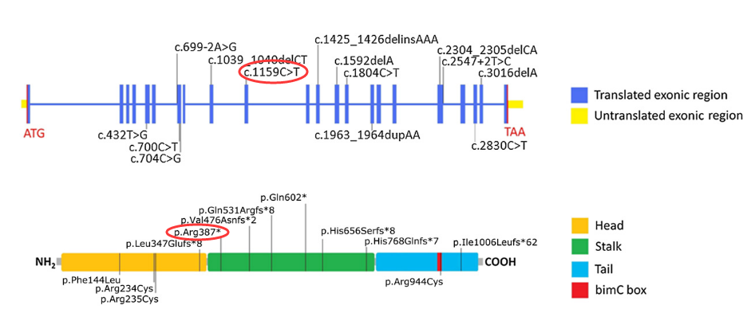

# Central spindle proteins and mitotic kinesins are direct transcriptional targets of MuvB, B-MYB and FOXM1 in breast cancer cell lines and are potential targets for therapy
## introduction
we sought to determine the mitotic kinesins that are directly regulated by MuvB, B-MYB and FOXM1.  
Of the 45 kinesins in the human genome, which are classified into 14 distinct families, at least 16 have been implicated in coordinating mitosis and cytokinesis [27].  
references [27]: Cross RA, McAinsh A. Prime movers: the mechanochemistry of mitotic kinesins. Nat Rev Mol Cell Biol. 2014; 15:257–271.

KIFC1，KIF4A, KIF2C都与癌症相关。

文中研究了MuvB，B-MYB，FOXM1下游的15个有丝分裂相关的kinesin和两个微管相关蛋白CEP55、PRC1.

结果显示：  
- at least six mitotic kinesins as well as CEP55 and PRC1 are direct targets of MMB in MDA-MB-231 breast cancer cells.
- suppression of KIF23 and PRC1 strongly suppressed proliferation of MDA-MB-231 cells.
- gene expression levels of PRC1 and KIF23 have prognostic value in terms of survival of breast cancer patients.
- The set of MMB-FOXM1 regulated kinesins genes and 4 additional kinesins which we referred to as the mitotic kinesin signature (MKS) showed prognostic value and are linked to poor outcome in breast cancer patients.

总之，有丝分裂相关kinesin可以作为预后的一个marker和乳腺癌治疗target。

## results

---

# KIF11 Is Required for Spheroid Formation by Oesophageal and Colorectal Cancer Cells
KIF11对食道癌和结直肠癌的球状体形成至关重要  
2017  
ANTICANCER RESEARCH  
影响因子：1.937  
第一单位：日本广岛大学

## 摘要
背景：  
- Oesophageal squamous cell carcinoma (ESCC) and colorectal cancer (CRC) are common types of human cancer.  
- Spheroid colony formation is used to characterize cancer stem cell (CSCs).

方法：
- 免疫组化方法在105例ESCC和100例CRC中检测KIF11表达量。
- RNAi抑制ESCC和CRC细胞系中KIF11的表达。

结果：  
- 61 out of 105 (58%) ESCC and 62 out of 100 (62%) CRC cases were positive for KIF11.
- Expression of KIF11 was not associated with any clinicopathological characteristics.
- Both the number and size of spheres produced by from TE-5 ESCC cells and DLD-1 CRC cells were significantly reduced upon KIF11 siRNA transfection compared to negative control siRNA transfection.

结论：
KIF11 plays an important role in CSCs of ESCC and CRC.

## introduction
## results
fig1. ESCC病人组织中kif11表达量  

A：反转录PCR测八个样品中KIF11的表达量FOLD是与无肿瘤组织的对照比。  

B: Immunohistochemical analysis of KIF11 in ESCC.  

C: Immunohistochemical analysis of KIF11 (left) and ALDH1 (right) in consecutive tumour sections of ESCC, showing marked coexpression

D: Kaplan–Meier plot of survival for patients with ESCC by tumour KIF11 expression  
生存分析显示，kif11阴性的病人相同时间存活率更高。  

fig2. CRC组织中KIF11表达量  

fig.3 ESCC细胞系中kif11 RNAi后蛋白表达量、球状体数量及大小统计  
  
fig.4 CRC细胞系中kif11 RNAi后蛋白表达量、球状体数量及大小统计  
  

## Discussion
KIF11 protein expression is upregulated in 72% of GC cases.  

---

# Mutations in KIF11 Cause Autosomal-Dominant Microcephaly Variably Associated with Congenital Lymphedema and Chorioretinopathy
KIF11突变引起的常染色体显性疾病头小畸形与先天性淋巴水肿和脉络膜视网膜病相关  
2012  
The American Journal of Human Genetics   
影响因子：9.025  
第一单位：St. George’s University of London（伦敦大学圣乔治学院）  

## results

- MLCRD (microcephaly, primary lymphedema, and chorioretinal dysplasia) syndrome
（头小畸形，原发性淋巴水肿，视网膜脉络膜发育不良）综合症  
- CDMMR (chorioretinal dysplasia, microcephaly, and mental retardation) syndrome 
（视网膜脉络膜发育不良，头小畸形，智力迟钝）综合症  

MLCRD和CDMMR有很多相似的表型。在这两种综合症中，头小畸形非常普遍且伴随发育迟缓、具有明显的面部表情特征(fig.1a and 1b).  

CDMMR05 II-1 患者外周视网膜脉络膜萎缩眼底聚焦面图片(fig.1c).  
  

另外，视网膜皱襞、小眼、近视及远视散光也有报道，甚至有些没有视力的问题。  

有没有淋巴水肿通常被认为区分这两种综合症的特征。  

MLCRD中的淋巴水肿是天生的且通常限于脚背的水肿(fig.1d)。  
  

淋巴显影显示：脚趾间注射同位素后，淋巴水肿患者脚部的主血管没有很好的填充，这说明淋巴血管的功能损伤。

为了找到疾病相关基因，作者对五个不相关的先证者进行了全外显子组测序，这五个先证者分别为MLCRD01:II-2, MLCRD02:II-2, MLCRD03:III-2, MLCRD04:I-1, and MLCRD05:I-1

外显子测序所有的突变统计

All three allelic mutations
- (a nonsense variant [p.Arg387*]
- a single-nucleotide deletion [p.Ile1006Leufs*62] 
- and a dinucleotide deletion [p.Leu347Glufs*8]) 
  
are predicted to cause changes to the KIF11 protein product(Table 1). 

结果显示kif11的杂合突变在MLCRD中占了很大的比重。

所以我们用sanger测序的方法对另外九个MLCRD家系中其他的kif11突变做了评估。

在这些家系中又鉴定出了7个kif11杂合突变: 
- three frameshift insertions and deletions
- two missense substitutions
- an acceptor splice-site substitution
- and a donor splice-site change

 that was observed in the proband from the multigenerational pedigree (Table 1)

我们从14个MLCRD家系中一共鉴定出10个KIF11突变

在小脑、眼睛异常又没有水肿的6个独立家庭中又鉴定出5个独立的突变位点：  
2个错义突变和3个其他的突变，包括之前鉴定出来的无义突变（p.Arg387*）。

###所以，我们一共在15个家庭27个个体中鉴定出14个突变位点。

其中7个等位基因突变，包括2个无义突变和5个移码突变（包括插入和删除），被认为可以使KIF11提前成熟结束转录。

另外有一个移码突变是在second-to-last外显子上的单碱基缺失，造成了最后50个氨基酸的替代，并且向后多翻译了12个氨基酸。

两个剪切位点的突变 are both predicted in HSF (Human Splicing Finder v.2.4.1) to have significant impact on the splicing of the 5 kb transcript (Table S6).

有四个错义突变改变了保守区的氨基酸,并且通过SIFT and PolyPhen预测改变了蛋白的功能。
其中3个(p.Phe144Leu, p.Arg234Cys, and p.Ser235Cys) 位于马达蛋白的马达区域，另外1个(p.Arg944Cys)位于C端的bimC box区。

###重要网址：
- 1000 Genomes Project,http://www.1000genomes.org, 有不同病人测序的结果，可以查找病人中的突变。
- Consensus Coding Sequence Project (CCDS) project, http://www. ncbi.nlm.nih.gov/projects/CCDS/
- dbSNP, http://www.ncbi.nlm.nih.gov/projects/SNP/，NCBI中搜索SNP。
- Human Splicing Finder, http://www.umd.be/HSF/ 
- Online Mendelian Inheritance in man (OMIM), http://www.omim.org/ ，基因分类及基因疾病相关信息。
- PolyPhen, http://genetics.bwh.harvard.edu/pph2/ 
- SIFT, http://sift.jcvi.org/

###kif研究进展介绍
http://www.omim.org/entry/148760?search=KIF11&highlight=kif11

####这篇文章中新鉴定出的突变：
- a 1159C-T transition in exon 10，arg387-to-ter ( R387X) substitution

- a 2-bp deletion (1039delCT) in exon 9，347，  frameshift and premature termination codon.

- a de novo 2830C-T transition in exon 3,arg944-to-cys (R944C) ，bimC box.

- *a 1-bp deletion (1592delA) in exon 13,frameshift and premature termination codon.*
- a 2547+2T-C transition in intron 18,premature termination.
- *a 704C-G transversion in exon 7,ser235-to-cys (S235C) substitution at a highly conserved residue within the motor domain.* 

####其他文章中鉴定出的位点：
Mirzaa et al. (2014)，Congenital microcephaly and chorioretinopathy due to de novo heterozygous KIF11 mutations: five novel mutations and review of the literature

- a de novo 2-bp deletion (c.2300_2301delTT; NM_004523.3) in exon 28,Phe767SerfsTer8， frameshift and premature termination.
-  a de novo mutation (c.790-1G-A) ,abolish the splice donor site of exons 7-8.

Robitaille et al. (2014),Phenotypic overlap between familial exudative vitreoretinopathy and microcephaly, lymphedema, and chorioretinal dysplasia caused by KIF11 mutations

- a heterozygous glu470-to-ter (E470X) substitution
- *an intronic mutation (c.790-1G-T)* 

Hu et al. (2016),KIF11 mutations are a common cause of autosomal dominant familial exudative vitreoretinopathy

- a c.2230C-T transition,gln744-to-ter (Q744X) substitution.