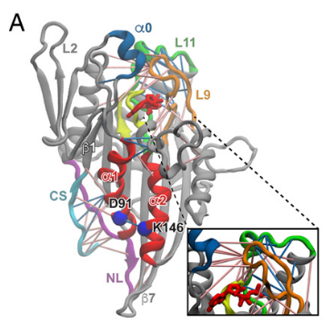

#A posttranslational modification of the mitotic kinesin Eg5 that enhances its mechanochemical coupling and alters its mitotic function

## Abstract 
We investigated one of these—acetylation of lysine 146 in Eg5—by creating an acetylation mimetic lysine to glutamine substitution (K146Q).Eg5的转录后修饰

Lysine 146 is located in the α2 helix of the motor domain, where it makes an ionic bond with aspartate 91 on the neighboring α1 helix.  

methods: structural kinetics and singlemolecule mechanics

results: the K146Q mutation increases motor performance under load and coupling of the neck linker to catalytic site.

These changes convert Eg5 from a motor that dissociates from the microtubule at low load into one that is more tightly coupled and dissociation resistant -- features shared by kinesin 1.

the K146Q Eg5 acetylation mimetic should act in the cell as a “brake” that slows spindle pole separation.

## Introduction
individual kinesins can play multiple cellular roles.

MTs also play multiple roles in cell physiology, and this adaptability is due in part to multiple posttranslational modifications (PTMs) (7–9)
7. Yu I, Garnham CP, Roll-Mecak A (2015) Writing and reading the tubulin code. J Biol Chem 290:17163–17172.
8. Janke C (2014) The tubulin code: Molecular components, readout mechanisms, and functions. J Cell Biol 206:461–472.
9. Sirajuddin M, Rice LM, Vale RD (2014) Regulation of microtubule motors by tubulin isotypes and post-translational modifications. Nat Cell Biol 16:335–344.
微管蛋白转录后修饰相关文献。

PTMs have been identified in most kinesins, including many in the catalytic domain of these enzymes (10, 11)
10. Hornbeck PV, et al. (2015) PhosphoSitePlus, 2014: Mutations, PTMs and recalibrations. Nucleic Acids Res 43:D512–D520.
11. Liu Z, et al. (2014) CPLM: A database of protein lysine modifications. Nucleic Acids Res 42:D531–D536.
马达蛋白转录后修饰文献

Multiple PTMs in the motor domain of the mitotic kinesin Eg5 have been reported (12), including in Loop 5 and helices α2and α3—all in the vicinity of the catalytic site (Fig. 1A).

12. Bickel KG, et al. (2017) Src family kinase phosphorylation of the motor domain of the human kinesin-5, Eg5. Cytoskeleton (Hoboken) 74:317–330.  Eg5转录后修饰位点

13. Falnikar A, Tole S, Baas PW (2011) Kinesin-5, a mitotic microtubule-associated motor protein, modulates neuronal migration. Mol Biol Cell 22:1561–1574.
14. Venere M, et al. (2015) The mitotic kinesin KIF11 is a driver of invasion, proliferation, and self-renewal in glioblastoma. Sci Transl Med 7:304ra143.
马达蛋白功能相关文献