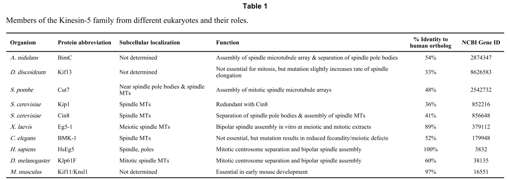
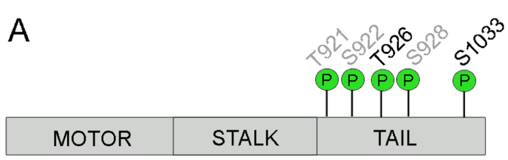
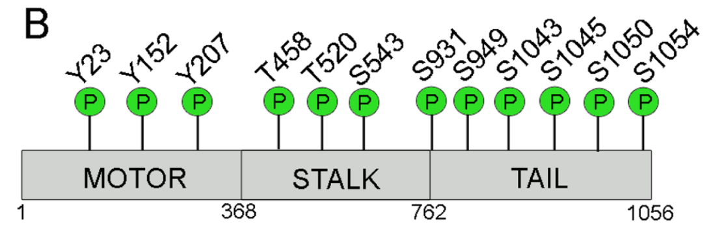
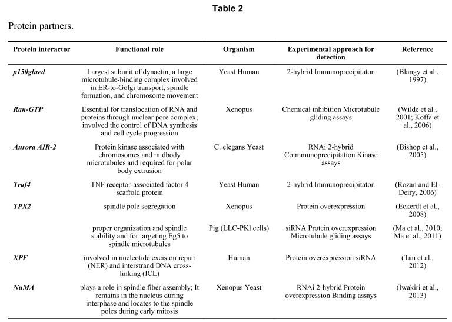

#Kinesin-5: cross-bridging mechanism to targeted clinical therapy
##Abstract

##1. INTRODUCTION
kinesin 5成员及功能

##2. CELLULAR FUNCTIONS OF KINESIN-5
###Mitotic roles of Kinesin-5
To date, for all eukaryotes examined, with the exceptions of C. elegans and D. discoideum wherein the motor is required for normal cell division, but not essential, Kinesin-5 activity is essential to assemble the mitotic spindle. 

motors support spindle pole separation by sliding antiparallel microtubules

Kinesin-5 in budding yeast, Cin8p, can depolymerize microtubules from their plus ends (Gardner et al., 2008).

The association of Kinesin-5, in most cases, is regulated by phosphorylation of a C-terminal cassette containing a CDK1 kinase consensus (Sawin and Mitchison, 1995; Sharp et al., 1999), or, in the case of C. elegans, an Aurora B kinase consensus (Bishop et al., 2005).

a complex regulation of Kinesin-5 activity within subdomains of the spindle, which currently remains an area of intense speculation. 

the Kinesin-5 motor domain displays two different types of interactions with microtubules. 
- Through a round of its mechanochemical cycle, Kinesin-5 alternately exhibits a high affinity bound state to microtubules as well as a low affinity release state.

- it can also assume an intermediate bound state that is permissive for one-dimensional diffusion along the microtubule lattice and that does not require the motor to consume ATP.(tail 的作用，后面会后面文献讲到)

Mayer et al. (1999) used a novel chemical genetic approach to discover monastrol, the first of many small chemical inhibitors of human Kinesin-5.第一个小分子药物

while HsEg5 function is critical for the separation of centrosomes in mammalian cells during prophase, it appears to be dispensable for the maintenance of the metaphase spindle and subsequent anaphase chromosome movements (Blangy et al., 1995; Kapoor et al., 2000).  HsEg5在细胞分裂前期是必需的，但是对中期纺锤体的维持及后期染色体的分裂不是必需的。

in yeast temperature-sensitive mutants or spindles assembled in Xenopus extracts, inhibition of Kinesin-5 function at metaphase results in spindle collapse (Saunders and Hoyt, 1992; Kapoor et al., 2000).在酵母和爪蟾细胞中期的必要的。

Kinesin-12 appears to be critical for maintaining spindle integrity at metaphase in the background of Kinesin-5 inhibition, while this redundancy is lacking in Xenopus spindles assembled in vitro (Tanenbaum et al., 2009; Florian and Mayer, 2011).可能是因为在某些物种中有其他基因替代了kinesin 5的功能。

microtubules move towards the spindle poles, where they are depolymerized via their minus ends by depolymerase complexes, and maintain a steady-state length or composition by a matching net polymerization of microtubules at the spindle midzone.    微管flux

Less clear is any functional involvement by Kinesin-5 in post-metaphase aspects of mitosis.关于有丝分裂中期之后

###Kinesin-5 in post-mitotic cells

Mammalian Kinesin-5 exhibits diffuse cytoplasmic localization in non-dividing cells without any clear enrichment on microtubule bundles (Levesque and Compton, 2001; Rapley et al., 2008a).不分裂的细胞中kif11的分布是弥散的。

Subsequent investigations using the newly developed small molecule inhibitors revealed a variety of developmental effects ranging from neuronal growth cone extension and navigation, to neuronal migration (Haque et al., 2004; Yoon et al., 2005). 神经细胞生长中的作用

Kinesin-5 function is required to modulate the transport of microtubules along axons and into growth cones in collaboration with cytoplasmic dynein.

peripheral neuropathy is reported in a small fraction of total toxicity analyses of Kinesin-5 inhibitors used in recent trials (Huszar et al., 2009; El-Nassan, 2013) with the dose-limiting toxicity in all the trials to date associated instead with severe neutropenia.
kif11抑制剂是否会引起神经疾病。

###Regulation of Kinesin-5 function

It is estimated that there are nearly 90,000 experimentally identified posttranslational modifications and 230,000 putative modifications existing on nearly 540,000 proteins (Khoury et al., 2011).

Of the 431 identified posttranslational modifications, phosphorylation is most frequently found. 

####Regulation via post-translational modifications in the C-terminal tail domain—

a TGXTPXK/RR motif was identified within the evolutionarily conserved BimC box and hypothesized to be a site for phosphorylation by several potential serine/threonine protein kinases (Heck et al., 1993). 磷酸化位点，tail端bimC box

either T937A and T937E mutations within the motif abolished XlEg5 localization to the mitotic spindle in Xenopus A6 cells, while, in contrast, a T937S mutation preserved this localization.爪蟾磷酸化位点

HsEg5, which was found to be phosphorylated at an equivalent site, Thr926, by Cdk1 (Blangy et al., 1995; Olsen et al., 2010). 对应的人的磷酸化位点

Phosphorylation by this kinase was determined to be directly responsible for the motor’s association with the spindle apparatus in early prophase.

Phosphorylation at Ser1033 was identified as necessary for normal mitotic progression (Rapley et al., 2008b). 另一个磷酸化位点

phosphorylation at Ser1033 occurred on only a small subset (~3%) of the total spindle-associated Kinesin-5.
distinct pools of Kinesin-5 that perform different tasks in cells, and is consistent with prior speculation (Uteng et al., 2008).不同kinesin 5状态在细胞内行使不同的功能

proteomics studies identified several phosphosites (Figure 4) beyond residues corresponding to Thr926 and Ser1033 in HsEg5, but no further analysis has been performed to characterize their potential role in functional regulation (Nousiainen et al., 2006; Bodenmiller et al., 2007; Zhai et al., 2008)蛋白质组鉴定出其他一些磷酸化位点，但是具体功能还不清楚。此处需注意！

Figure 4. Experimentally identified phosphorylation sites on Kinesin-5 
(A) Phosphosites of HsEg5 (black text) and BMK-1 (grey text) that are required to regulate Kinesin-5 function. 
(B) Additional phosphosites identified in human, Drosophila, and Xenopus in which their role in regulation is undetermined. Cartoon representation of Kinesin-5 linear sequence (grey rectangle) with phosphorylation sites (green spheres) in approximate location with motor, stalk or tail domains.

####Regulation via post-translational modifications of the N-terminal motor domain—

three tyrosine residues within the D. melanogaster KLP61F motor domain were determined as being phosphorylated (Figure 4) within close proximity to regions of the protein involved in nucleotide sensing and microtubule interactions(Garcia et al., 2009). 核酸感应区与微管结合区的三个酪氨酸位点磷酸化与kinesin 5的功能相关。

(Avunie-Masala et al., 2011)酵母里面对应的三个位点。

####Indirect regulation of Kinesin-5—

The E3 ubiquitin ligase, Parkin, indirectly down-regulated Kinesin-5 gene transcription (Liu et al., 2008a), y blocking the binding of c-Jun NH2-terminal kinase to the Kinesin-5 AP1 (activator protein 1) site in its promoter.parkin下调kinesin 5的表达，通过阻止c-Jun NH2-terminal kinase结合到kinesin 5启动子上的AP1蛋白。

####Protein-protein interactions that regulate Kinesin-5—

与kinesin 5相互作用的蛋白

its role in diseases (Formstecher et al., 2006; Liu et al., 2008a; Dharmapuri et al., 2011; GrothPedersen et al., 2012; Marra et al., 2013; Martens-de Kemp et al., 2013; Tabernero et al., 2013), 疾病相关文献

A discrete domain within the C-terminus of TPX2 was identified as the site of its interaction with Kinesin-5 (Eckerdt et al., 2008). This interaction was determined as necessary for spindle pole segregation and spindle stability as well as for targeting Kinesin-5 to spindle microtubules (Eckerdt et al., 2008; Ma et al., 2010; Ma et al., 2011). 

Kinesin-5 was also shown to directly interact with NuMA (nuclear mitotic apparatus) protein and required for NuMA localization to the mitotic spindle (Iwakiri et al., 2013). 

Kinesin-5 colocalized with the dynactin subunit p150Glued in vivo and interacted via the Kinesin-5 tail domain in vitro, suggesting that these two proteins may interact in vivo at the conserved Cdk1 site (Blangy et al., 1997).

Ran-GTP(Wilde et al., 2001)(Koffa et al., 2006)
AIR-2   (Bishop et al., 2005)
Traf4 (tumor necrosis factor receptor associated factor 4)(Rozan and El-Deiry, 2006)

The nuclear XPF (Xeroderma pigmentosum group F) protein, which plays a role in DNA repair, was also concluded to interact with Kinesin-5 (Tan et al., 2012).

##3. MECHANISM OF KINESIN-5

Knowledge of motor mechanism, relies heavily on two types of in vitro investigations.

- chemical-kinetic measurements of molecular motor.
- single-molecule experiments:micromechanical and optical techniques

###Catalysis in monomeric HsEg5
Biochemical data discriminate between the Kinesin-5 proteins and other kinesin counterparts.

In vitro ATPase activity of human Kinesin-5 is slower than other kinesin motors (Maliga et al., 2002; DeBonis et al., 2003; Cochran et al., 2004).

binding of monomeric HsEg5 to microtubules results in rapid release of the ADP product. 

X-ray crystallography: a central 8-stranded β-sheet, with 3 helices on each side. 

Within the motor domain, kinesins possess three distinct conserved ‘switches’ (Vale, 1996; Vale and Milligan, 2000; Kikkawa et al., 2001; Sablin and Fletterick, 2001; Kull and Endow, 2002): the P loop, switch I, and switch II/helix regions (Figure 2).

- The P loop is responsible for the binding of the α- and β-phosphate groups of the nucleotide
- switch I and switch II loops interact selectively with the γ-phosphate moiety

39 of the 125 kinesin x-ray structures in the PDB are of HsEg5. 

