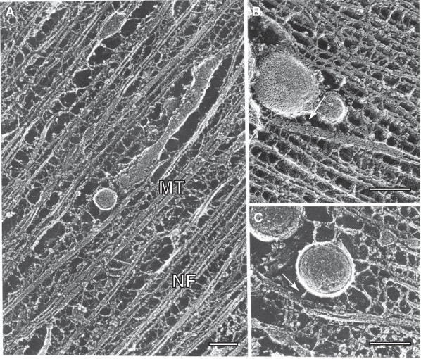
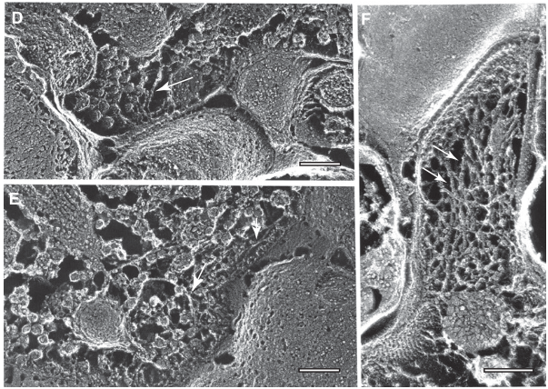
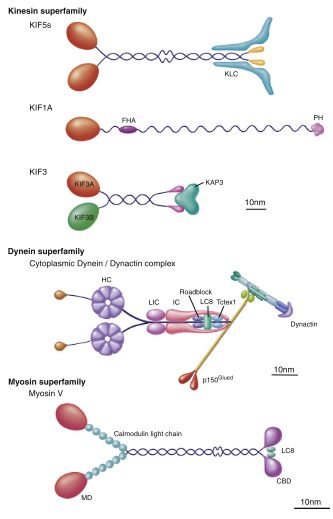
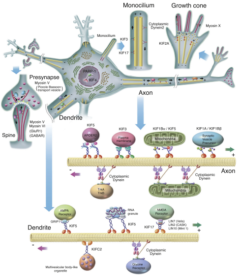
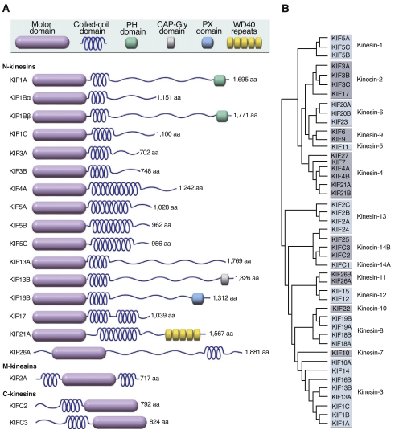
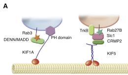
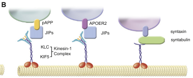
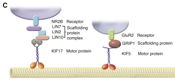
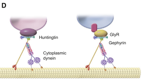
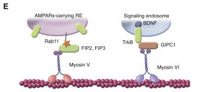

#Molecular Motors in Neurons: Transport Mechanisms and Roles in Brain Function, Development, and Disease  
Nobutaka Hirokawa,1,* Shinsuke Niwa,1 and Yosuke Tanaka1

1Departments of Cell Biology and Anatomy and Molecular Structure and Dynamics, Graduate School of Medicine, University of Tokyo, Hongo, Tokyo 113-0033, Japan *Correspondence: hirokawa@m.u-tokyo.ac.jp DOI 10.1016/j.neuron.2010.09.039

The kinesin, dynein, and myosin superfamily molecular motors have fundamental roles in neuronal function, plasticity, morphogenesis, and survival by transporting cargos such as synaptic vesicle precursors, neurotransmitter and neurotrophic factor receptors, and mRNAs within axons, dendrites, and synapses.// motor protein 在神经细胞中的功能

most of the proteins necessary for the axon and synaptic terminals must be transported down the axon after synthesis in the cell body. //大多数末梢蛋白需要在胞体合成

intracellular transport is fundamental for neuronal morphogenesis, function, and survival.

Figure 1. The Neuronal Cytoskeleton Revealed by Quick-Freeze Deep-Etch Electron Microscopy
A.微管、微丝及囊泡
B.囊泡在微管上，箭头所示为kinesin
C.囊泡及微丝，箭头所示为myosin

D、E. 突出前膜，actin与突触前膜相连
F. postsynaptic spine，箭头示actin与之相连
比例尺100 nm。

Microtubule rails have a polarity: in the axon and the distal dendrites, the plus end (the fast growing end) points distally, whereas in the proximal dendrites, the polarity is mixed.//轴突与树突中微管的排向

Actin filaments also have a polarity: the barbed end (the growing end) points to the plasma membrane in the presynaptic and postsynaptic regions.//微丝的走向

Figure 2. Structure of Motor Proteins

Figure 3. Intracellular Transport in Neurons Various KIFs transport membranous organelles anterogradely in axons and dendrites, whereas cytoplasmic dynein 1 and KIFC2 transport retrograde cargos. In neuronal cilia, anterograde transport is performed by KIF3 and KIF17, while retrograde transport is performed by cytoplasmic dynein 2. In short-range transport, such as transport in the pre- and postsynapses and growth cone filopodia, the myosin family proteins function as the molecular motors.
信息量比较大，仔细阅读

kinesin分类：N-terminal motor domain KIFs (N-KIFs), middle motor domain KIFs (M-KIFs), and C-terminal motor domain KIFs (C-KIFs)

Figure 4. Diversity among KIFs (A) Structure of KIFs. (B) Phylogenetic tree of KIFs.

In mammals such as human and mouse, the total number of Kif genes is 45, including three M-Kifs (Kif2a, Kif2b, and Kif2c) and three C-KIFs (Kifc1, Kifc2, and Kifc3). Kif genes have been classified into 14 classes (Aizawa et al., 1992; Miki et al., 2001; Lawrence et al., 2004; Figure 4B).

kif genes个数及进化树

N-terminal KIFs generally move toward microtubule plus ends, while C-terminal KIFs move toward minus ends. KIF2A and 2C are unique KIFs that depolymerize microtubules in an ATPdependent manner.
结构不同，功能不同

Figure 5. Cargo Recognition Mechanisms
 (A) Cargo recognition via Rab GTPases. KIF1A transports Rab3-carrying synaptic vesicle precursors via its PH domain and the DENN/MADD-Rab3 complex. This dual binding ensures precise cargo recognition. KIF5 transports TrkB vesicles via the CRMP2-Slc1 complex. Rab27B and TrkB both bind to Slc1; this also ensures precise association with cargos. 

 
 (B) KIF5 transports axonal vesicles via JIPs and syntabulin. JIPs are suggested to associate with KLC and vesicular proteins such as phosphorylated APP (pAPP) and APOER2. Syntabulin directly associates with KIF5 and functions as an adaptor to recognize syntaxin vesicles.

(C) KIFs transport dendrite receptors via scaffolding proteins. KIF17 transports NMDA-type glutamate receptors NR2 by associating with a scaffolding complex consisting of LIN10 (Mint1), LIN2, and LIN7. KIF5 transports the AMPA-type glutamate receptor GluR2 via the scaffolding protein GRIP.

(D) Cargo recognition by cytoplasmic dynein. The dynactin complex binds to huntingtin and retrogradely transports vesicles. Cytoplasmic dynein transports glycine receptors (GlyR) via the scaffolding protein gephyrin; this mechanism is similar to cargo recognition by KIFs.

(E) Myosin V recognizes AMPAR-carrying recycling endosomes (REs) via the Rab11-FIPs complex. Myosin VI retrogradely transports BDNF-TrkB-signaling endosomes via GIPC1.

Dynein superfamily proteins comprise two major groups, cytoplasmic dyneins and axonemal dyneins.//Dynein 分类

Cytoplasmic dynein consists of a huge protein complex of approximately 1.5 megadaltons, containing multiple polypeptide subunits: two heavy chains (520 kDa), two intermediate chains (74 kDa), four intermediate light chains (33–59 kDa) and several light chains (10–14 kDa).//Dynein 组成

Dynactin, containing p150Glued, p62, dynamitin,actin-related protein (Arp) 1, CAPZa and CAPZb, p27, and p24.//Dynactin组成

cytoplasmic dyneins have only two heavy chain family members, cytoplasmic dynein heavy chain 1 (Dync1h1) and cytoplasmic dynein heavy chain 2 (Dync2h1).Dync1h1 mainly serves in minus end-directed cytoplasmic transport and Dyhc2h1 mainly functions in retrograde intraflagellar transport.//Dynein heavy chain

myosin

本文关注的问题：
(1) What kind of cargo(s) does each motor transport? (2) How does the motor recognize and bind its cargo(s)? (3) How does the motor regulate loading and unloading of the cargo(s)? (4) How is the activity of the motor regulated in terms of velocity and binding to microtubules? (5)ow is bidirectional transport regulated? (6) How is the fast transport of membranous organelles and the slow transport of cytoplasmic proteins regulated? (7) How is the direction of transport in axons versus dendrites determined? (8) What is the biological significance of the motor function at the whole-body level? (9) To what diseases does disturbance in motor function relate, and how is the motor involved in the pathogenesis of those diseases? 

目前研究的主要motor及相关信息在table 1中。

作者本文聚焦的蛋白：
eripheral nervous system (PNS) development (Tables 2 and 3). In particular, we will focus on the neuronal roles of KIF1A, KIF1Ba and KIF1Bb, KIF2A, KIF3, KIF4, KIF5s, KIF13B, KIF17, KIF26A, and KIFC2 from the kinesin superfamily; cytoplasmic dynein and dynactin; and myosin I, myosin II, myosin V, myosin VI, myosin VII, and myosin X from the myosin superfamily.

需要继续看

